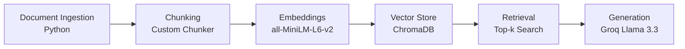

# Project 1 Planning: The Unofficial Guide

> Write this document before you write any pipeline code.
> Your spec and architecture diagram are what you'll use to direct AI tools (Claude, Copilot, etc.) to generate your implementation — the more specific they are, the more useful the generated code will be.
> Update the Retrieval Approach and Chunking Strategy sections if you change your approach during implementation.
> Update this file before starting any stretch features.

---

## Domain

<!-- What domain did you choose? Why is this knowledge valuable and hard to find through official channels? -->
USC CS Course and Professor Reviews
This project makes student experiences with USC computer science courses and professors searchable. The system focuses on information such as teaching style, workload, exam difficulty, grading practices, and course expectations gathered from student reviews and discussions. This knowledge is difficult to find through official university channels because course catalogs and department websites describe course content but rarely capture the day-to-day experiences and opinions shared by students.

---

## Documents

<!-- List your specific sources: URLs, subreddit names, forum threads, or file descriptions.
     Aim for at least 10 sources that together cover different subtopics or perspectives within your domain. -->

| # | Source | Description | URL or location |
|---|--------|-------------|-----------------|
| 1 | Saty Raghavachary (RMP) | Student reviews discussing teaching style, workload, exams, and overall course experience. | https://www.ratemyprofessors.com/professor/798241 |
| 2 | USC Reddit - CSCI 572 with Saty | Student discussion about taking CSCI 572 with Professor Saty Raghavachary. | https://www.reddit.com/r/USC/comments/15ud6gx/how_is_csci_572_with_prof_saty/ |
| 3 | USC Reddit - CSCI 585 | Student discussion about workload, projects, and difficulty of CSCI 585. | https://www.reddit.com/r/USC/comments/11jscpe/how_csci585_is/ |
| 4 | Professor Reviews (RMP) | Student reviews for professor ID 1104782 covering grading, teaching quality, and course expectations. | https://www.ratemyprofessors.com/professor/1104782 |
| 5 | USC Reddit - CSCI 571 Discussion | Student discussion regarding experiences and concerns related to CSCI 571. | https://www.reddit.com/r/USC/comments/15eqr36/the_csci_571_misrepresentation_scandal/ |
| 6 | Professor Reviews (RMP) | Student reviews for professor ID 3125237 discussing course structure and instructor effectiveness. | https://www.ratemyprofessors.com/professor/3125237 |
| 7 | Professor Reviews (RMP) | Student reviews for professor ID 2294843 discussing workload, grading, and teaching style. | https://www.ratemyprofessors.com/professor/2294843 |
| 8 | USC Reddit - DSCI 552 | Student discussion about DSCI 552 workload, difficulty, and grading policies. | https://www.reddit.com/r/USC/comments/1co1472/any_thoughts_on_the_dsci_552_how_hard_is_it_to/ |
| 9 | Professor Reviews (RMP) | Student reviews for professor ID 1307919 discussing classroom experience and course expectations. | https://www.ratemyprofessors.com/professor/1307919 |
| 10 | USC Reddit - CSCI 526 / CSCI 538 | Student discussion comparing experiences in CSCI 526 and CSCI 538. | https://www.reddit.com/r/USC/comments/a7ued1/anyone_taken_csci_526_or_csci_538/ |

## Chunking Strategy

<!-- How will you split documents into chunks?
     State your chunk size (in tokens or characters), overlap size, and explain why those
     numbers fit the structure of your documents.
     A review-heavy corpus warrants different chunking than a long FAQ. -->

**Chunk size:**
300 tokens

**Overlap:**
50 tokens

**Reasoning:**
My document collection contains both short Rate My Professors reviews and longer Reddit discussions. A chunk size of approximately 300 tokens is large enough to preserve complete thoughts about teaching style, exams, workload, or grading while still being small enough for precise retrieval. I will use a 50-token overlap so that important information near chunk boundaries is not lost. Before chunking, I will remove unnecessary text such as navigation elements, metadata, and other non-content text when possible.
---

## Retrieval Approach

<!-- Which embedding model are you using (e.g., all-MiniLM-L6-v2 via sentence-transformers)?
     How many chunks will you retrieve per query (top-k)?
     If you were deploying this for real users and cost wasn't a constraint, what tradeoffs
     would you weigh in choosing a different embedding model — context length, multilingual
     support, accuracy on domain-specific text, latency? -->

**Embedding model:**
all-MiniLM-L6-v2 (sentence-transformers)

**Top-k:**
4
**Production tradeoff reflection:**
I chose all-MiniLM-L6-v2 because it is free, runs locally, and is commonly used for semantic search tasks. For a production system, I would compare larger embedding models that may provide better retrieval quality, multilingual support, and domain-specific understanding. I would also consider latency, API cost, and context length when selecting an embedding model.
---

## Evaluation Plan

<!-- List your 5 test questions with their expected correct answers.
     Questions should be specific enough that you can judge whether the system's response
     is right or wrong. "What are good dining halls?" is too vague.
     "What do students say about wait times at [dining hall name] during lunch?" is testable. -->

| # | Question | Expected answer |
|---|----------|-----------------|
| 1 | What do students say about Saty Raghavachary's teaching style? | Students describe Saty's teaching style, communication, and classroom effectiveness. The answer should be grounded in the collected reviews and Reddit discussion. |
| 2 | How difficult do students think CSCI 572 is? | Students discuss the workload, project difficulty, and overall challenge level of CSCI 572. |
| 3 | What concerns were raised about CSCI 571? | The answer should summarize the issues and concerns discussed in the CSCI 571 Reddit thread. |
| 4 | What do students say about the workload in DSCI 552? | Students describe the workload, assignments, projects, and time commitment required for DSCI 552. |
| 5 | How do students compare CSCI 526 and CSCI 538? | Students compare the difficulty, workload, course content, and recommendations for taking CSCI 526 versus CSCI 538. |

---

## Anticipated Challenges

<!-- What could go wrong? Name at least two specific risks with reasoning.
     Consider: noisy or inconsistent documents, missing source attribution, off-topic
     retrieval, chunks that split key information across boundaries. -->

1.Some documents contain informal language, jokes, or conflicting opinions that may make retrieval and summarization difficult.

2.Important information may be split across multiple comments or chunk boundaries, causing retrieval to miss part of the context needed for a complete answer.

---

## Architecture

<!-- Draw a diagram of your pipeline showing the five stages:
     Document Ingestion → Chunking → Embedding + Vector Store → Retrieval → Generation
     Label each stage with the tool or library you're using.
     You can use ASCII art, a Mermaid diagram, or embed a sketch as an image.
     You'll use this diagram as context when prompting AI tools to implement each stage. -->

---

## AI Tool Plan

<!-- For each part of the pipeline below, describe:
     - Which AI tool you plan to use (Claude, Copilot, ChatGPT, etc.)
     - What you'll give it as input (which sections of this planning.md, which requirements)
     - What you expect it to produce
     - How you'll verify the output matches your spec

     "I'll use AI to help me code" is not a plan.
     "I'll give Claude my Chunking Strategy section and ask it to implement chunk_text()
     with my specified chunk size and overlap" is a plan. -->

**Milestone 3 — Ingestion and chunking:**

I will use Claude to help implement document loading, cleaning, and chunking. I will provide my document list and chunking strategy and ask for a chunking function that produces approximately 300-token chunks with overlap. I will verify the output by manually inspecting sample chunks.

**Milestone 4 — Embedding and retrieval:**

I will use Claude to help implement embedding generation and ChromaDB retrieval. I will provide my Retrieval Approach section and architecture diagram and ask for code that loads chunks from the ingestion pipeline, embeds them using all-MiniLM-L6-v2, stores them in ChromaDB, and retrieves the top 4 most relevant chunks for a query. I will verify retrieval quality by testing several evaluation questions and inspecting the returned chunks.

**Milestone 5 — Generation and interface:**

I will use Claude to help implement grounded answer generation and the query interface. I will provide my retrieval pipeline and grounding requirements and ask for code that uses Groq's Llama model to answer questions using only retrieved context. I will verify that responses include source attribution and that unsupported questions return an "I don't have enough information" style response.
